<div align="center">


### 🚀 Full Stack Developer | AI/ML Enthusiast | One Piece Theorist




</div>

## 🌟 About Me

<div align="center">
  
</div>

```typescript
class Developer {
    name = "Anik Das";
    location = "India 🇮🇳";
    currentFocus = "Deep Learning";
    pronouns = "he/him";
    exploring = ["AI/ML", "Computer Vision", "System Design"];
    hobbies = ["Photography 📸", "Travelling 🌍", "Open Source", "Anime 🍥"];
    contact = "anikdas210605@gmail.com";
    dailyRoutine = ["☕ Coffee", "💻 Code", "🐛 Debug", "🔁 Repeat"];

    funFact(): string {
        return "I mass deploy bugs to production on fridays 🚀";
    }

    currentStatus(): string {
        return "Somewhere between 'it works!' and 'why does it work?' 🤔";
    }
}
```

<div align="center">

### 🌐 Connect With Me

[](https://linkedin.com/in/anikdas21)
[](https://instagram.com/anikk.dass)
[](https://stackoverflow.com/users/26660250)
[](mailto:anikdas210605@gmail.com)

</div>

## ⚡ What I'm Up To

<div align="center">

🔭 Currently building **AI-powered side projects**

🧠 Learning **Deep Learning & Computer Vision**

⚓ Fun fact: I firmly believe **Luffy will be the King of Pirates**

🎯 2026 Goals: Contribute more to **Open Source** & build something that gets **1000+ stars** ⭐

💬 Ask me about **React, Next.js, Node.js, or why One Piece > everything**

</div>

## 🎲 Fun Facts

<div align="center">

| 🤓 Fact | 💬 Details |
|---------|------------|
| 🕐 Coding since | I could say "Hello World" |
| ☕ Coffee consumed | `Integer.MAX_VALUE` cups |
| 🐛 Bugs created | More than features, honestly |
| 📚 Stack Overflow visits | Yes |
| 🎵 Codes best with | Lo-fi beats & anime OSTs |
| 🏴‍☠️ Favorite anime | One Piece (not debatable) |
| 💤 Sleep schedule | `cron: */0 * * * *` (never runs) |

</div>

<h2 align="center">💻 Tech Arsenal</h2>
<p align="center"><i>Fullstack Engineer · React + Node Specialist · AI/ML Enthusiast</i></p>

<br>

<div align="center">

| **Languages** | **Frontend** | **Backend** | **Databases** |
|:---:|:---:|:---:|:---:|
|         |     |     |       |
| **AI / ML** | **DevOps** | **Tools & Editors** | **Deployment** |
|     |      |      |   |

</div>

## 📊 GitHub Analytics

<div align="center">


<br/>


<br/>


</div>

## 🏆 Achievements

<div align="center">


</div>

## 📈 Contribution Stats

<div align="center">


</div>

---

## 🐍 Contribution Snake

<div align="center">


</div>

## 👾 Contribution Invaders

<div align="center">


</div>

---

<div align="center">

### 💭 Developer Quote


---

### 🎵 Currently Vibing To

[](https://open.spotify.com/user/coderanik)


**⭐️ From [coderanik](https://github.com/coderanik) with ❤️**

*"The only way to do great work is to love what you do — and occasionally break production."*

</div>
